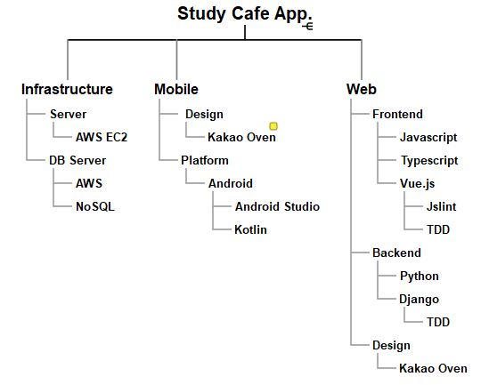

# HomeCafeAndroid

## Home Cafe project for android to use at my home.
0. Design & Tech Map
   - 
1. App. design
   - I drew a design on `Kakao Oven`, one of the good design tools.
   - You can see the design from this [link](https://ovenapp.io/view/vbDFThxBEhYwemSn7LwHGZThbHttNKhx/).
2. Platform
   - [Language] `Kotlin`
   - [OS] `Android`
   - [IDE] `Anroid Studio`
   - [TDD] `TDD`
3. Infrastructure
   - Local DB(MySQL) > AWS EC2(NoSQL)
4. Project Trace
   1. Main Screen (25/May/2021 ~ )
   2. Management Menu Screen
   3. Management Order Screen
   4. Balance screen